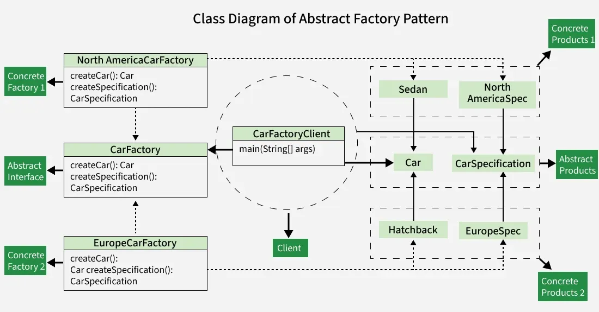

# Abstract Factory Pattern

The **Abstract Factory Pattern** is a creational design pattern that provides an interface for creating families of related or dependent objects without specifying their concrete classes. It acts as a **"factory of factories,"** where a super-factory creates other factories that in turn produce specific objects.

- Works around a super-factory that produces multiple factories.
- Concrete factories created at runtime decide the actual product types.
- Useful when the system needs to be independent of how products are created or represented.
- Makes it easy to switch between different groups of related objects without code changes.

---

## Features

The Abstract Factory Pattern provides a structured way to create related objects while keeping client code independent of their concrete implementations.

- Creates families of related or dependent objects.
- Provides an interface for creating multiple related products.
- Concrete factories decide the actual product types at runtime.
- Promotes consistency among products of the same family.

---

## Uses

The Abstract Factory Pattern is useful when a system needs flexibility in creating related objects without tightly coupling to specific classes.

- When a system should be independent of how its products are created.
- When products are designed to be used together as a family.
- When switching between multiple product families (e.g., Light Theme / Dark Theme).
- When you want to enforce consistency among related products.

---

## Components

To understand the Abstract Factory Pattern, we need to understand its components and the relationships between them.

| Component | Description |
|---|---|
| **Abstract Factory** | Provides a common interface that concrete factories must follow, ensuring a consistent way to produce a related set of objects. |
| **Concrete Factories** | Implement the rules specified by the abstract factory and contain the logic for creating specific instances of objects within a family. |
| **Abstract Products** | Act as abstract types that all concrete products within a family must follow, providing a unified way for products to be used interchangeably. |
| **Concrete Products** | Implement the methods declared in abstract products, ensuring consistency within a family, and belong to a specific category or family of related objects. |
| **Client** | Utilizes the abstract factory to create families of objects without specifying their concrete types, and interacts with objects through abstract interfaces. |

---

## Example

### Scenario

Imagine you're managing a **global car manufacturing company**:

- You want to design a system to create cars with specific configurations for different regions, such as **North America** and **Europe**.
- Each region may have unique requirements and regulations, and you want to ensure that cars produced for each region meet those standards.

### Challenges

- Different regions have different cars with different features, making the design complex.
- Ensuring consistency in the production of cars and their specifications within each region.
- Adapting the system to changes in regulations or introducing new features for a specific region.
- Modifications would need to be made in multiple places, increasing the risk of bugs and errors.

### Solution Using Abstract Factory Pattern

| Challenge | How the Pattern Helps |
|---|---|
| Region-specific cars | Each region gets its own factory to create cars tailored to local needs. |
| Consistency | Keeps design and features consistent for vehicles within each region. |
| Isolation of changes | You can update one region without affecting others (e.g., updating North America doesn't impact Europe). |
| Adding new regions | Just create a new factory — no need to change existing code. |
| Separation of concerns | Keeps car creation separate from how cars are used. |

---

## Class Diagram

### Diagram Breakdown

**Abstract Interface**
- `CarFactory`
  - `createCar(): Car`
  - `createSpecification(): CarSpecification`

**Concrete Factories**
- `NorthAmericaCarFactory` (Concrete Factory 1)
  - `createCar(): Car`
  - `createSpecification(): CarSpecification`
- `EuropeCarFactory` (Concrete Factory 2)
  - `createCar(): Car`
  - `createSpecification(): CarSpecification`

**Abstract Products**
- `Car`
- `CarSpecification`

**Concrete Products**
- Concrete Products 1 (North America): `Sedan`, `NorthAmericaSpec`
- Concrete Products 2 (Europe): `Hatchback`, `EuropeSpec`

**Client**
- `CarFactoryClient`
  - `main(String[] args)`
  - Interacts with `CarFactory`, `Car`, and `CarSpecification` through abstract interfaces.

---

## Summary

The Abstract Factory Pattern elegantly solves the problem of creating families of related objects by:

1. Defining a **common interface** for all factories.
2. Letting **concrete factories** handle region- or context-specific object creation.
3. Ensuring the **client** remains decoupled from specific implementations.
4. Making it trivial to **extend** the system with new families without modifying existing code.